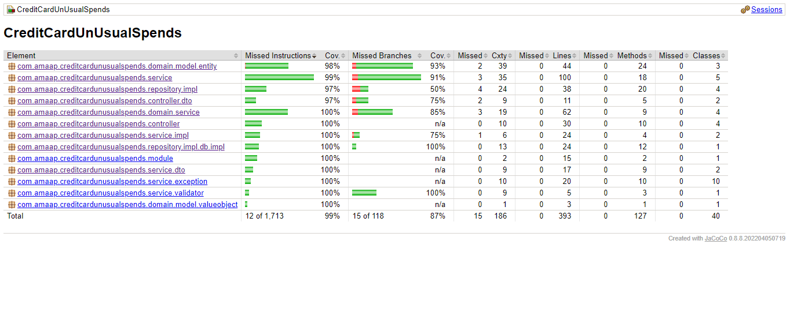
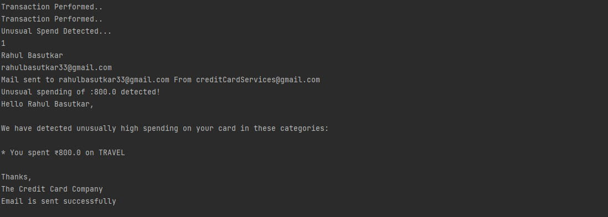

# Credit Card Unusual Spends

# Unusual Spends

You work at a credit card company and as a value-add they want to start providing alerts to users when their spending in any particular category is higher than usual.

## Functionality
- Compare the total amount paid for the current month, grouped by category, with the previous month.
- Filter down to the categories for which the user spent at least 50% more this month than last month.
- Compose an e-mail message to the user that lists the categories for which spending was unusually high.

## Sample Email

Subject: Unusual spending of ₹1076 detected!

Hello Baburao!

We have detected unusually high spending on your card in these categories:

You spent ₹148 on groceries
You spent ₹928 on travel
Thanks,

The Credit Card Company

## Jacoco Report

## Design Analysis

### Controllers
- **Classes and Behaviors**
    - #### CustomerController
        - `Response createUser(String name, String email)`
        - **DTO**
            - `Response`
            - `Http` (Enum)
    - #### CreditCardController
        - `Response createCardFor(int UserId)`
    - #### TransactionController
        - `Response initialiseTransaction(Long CreditCardNumber,String date, String  category, Double amount)`
    - #### ExpenditureController
        - `Response getUnusualSpendsFor(Long creditCardNumber)`

### Outer Service
- **Classes and Behaviors**
    - #### CustomerService
        - `boolean create( String name, String email)`
    - #### CreditCardService
        - `boolean createCard(int userId)`
    - #### TransactionService
        - `boolean performTransaction(Long creditcardNumber,String  date, String category, Double amount)`
    - #### ExpenditureService
        - `boolean getUnusualSpends(Long creditCardNumber)`
    - #### NotifierService[Interface]
         ` boolean sendNotification(String name, String email, List<UnusualSpendNotificationDTO.SpendDetail> spendDetails, double totalExpenditure)`
           Implementation: EmailComposer,
                           GoogleEmailSender,
          
    - #### DTO
       ` UnusualSpendNotificationDTO`
        States
      private String userName;
      private String userEmail;
      private List<SpendDetail> spendDetails;
      private double totalUnusualSpends;
       Behaviours
    -  public UnusualSpendNotificationDTO(String userName, String userEmail, List<SpendDetail> spendDetails, double totalUnusualSpends)
    - pubic getters()
   

### Domain
- **Model**
-    **Entity**
    -  #### Customer
      States
    - `private static int lastAssignedId `
    - `privte int id `
    - `privte String  name `
    - `privte String  email`
      Behaviours
    -  `public Customer(String name,String email)`     it returns an entity with id that is created automcatically
    -  `public getters()`
    -  #### CreditCard
      States
    - `private int userId`
    - `private long creditCardNumber`
      Behaviours
    - `public CreditCard(int userId)`
    - `private long generateCreditCardNumber()`   it is used to automatically generate 10 digit credit card number
    - `public getters()`
    
    -  #### Transaction
       States
    -  `private long creditCardNumber`
    -  `private Date date`
    -  `private SpendCategory category`
    -  `private long amount`
      Behaviours
    - `public Transaction(long creditCardNumber, Date date, SpendCategory category, long amount)`
    - `pulbic getters()`
  
-    **ValueObjects**
    - #### SpendCategories (Enum)

- **InnerService**
    - **Classes and Behaviors**
        - #### UnusualSpendAnalyser
            - `List<Map<String, Object>> getSpends(List<Transaction> transactionData)`
        - #### Analyzer
            - `public List<Map<String, Object>> findUnusualSpends(List<Transaction> currentMonthTransactions, List<Transaction> previousMonthTransactions, double thresholdPercentage)`
            - `private Map<String, Double> calculateCategorySpending(List<Transaction> transactions) `
        - #### CurrentMonthTransaction
            - `public static List<Transaction> getCurrentMonthTransactions(List<Transaction> transactionData)`
        - #### LastMonthTransaction
            - `public static List<Transaction> getLastMonthTransactions(List<Transaction> transactionData)`
        - #### SpendingAnalyzer (interface)
            - ` List<Map<String, Object>> findUnusualSpends(List<Transaction> currentMonthTransactions, List<Transaction> previousMonthTransactions, double thresholdPercentage);`
        

### Repository (interface)
- #### CustomerRepository
 ` void addCustomerData(Customer customer)`
  `List<Customer> getCustomer()`
  `Customer findCustomerByNameAndEmail(String name, String email)`
  `Customer getCustomerById(int id)`

- #### CreditCardRepository
  `void addCreditCardData(CreditCard creditCard)`
  `List<CreditCard> getCreditCards()`
  `boolean isCreditCardPresent(Long creditCardNumber)`
  `int getUserIdByCreditCardNumber(Long creditCardNumber)`
- #### TransactionRepository
 `void addIntoTransactionData(Transaction transaction)`
 ` List<Transaction> getTransactionData()`
- #### ExpenditureRepository
  `void addIntoExpenditureData(List<Map<String, Object>> spendData)`;
  `List<Map<String, Object>> getSpendData()`

### Database
-  #### Database (interface)
 `void insertIntoCustomerTable(Customer customer)`

 `List<Customer> getCustomerList()`

  `void insertIntoCreditCardData(CreditCard creditCard)`

  `List<CreditCard> getCreditCardData()`

  `void insertIntoTransactionTable(Transaction transaction)`

  `List<Transaction> getTransactions()`

  `boolean isCreditCardPresent(Long creditCardNumber)`

  `void insertIntoExpenditureTable(List<Map<String, Object>> spendData)`

  `List<Map<String, Object>> getSpendsData()`

  `void clear()`
### DTO
- **UnusualSpendAlertDTO**: Used for taking the information to send email.

### Module
- **AppModule**: For managing the dependencies.

## Workflow
- **CustomerController**: By using this, the system creates a unique user with the help of the service and stores it into the repository.
- **CreditCardController**: By using this, the system takes the credit card number from the user and, with the help of the service, validates it and saves it into the repository.
- **TransactionController**: This is used to initialize the transaction and, with the help of outer and inner services, saves all transactions in the repository.
- **ExpenditureController**: It is used to get the unusual spends from the current month and past month with the help of inner service and, if found, stores them in the repository and also triggers notification service if spends caught.

## MainClass Output

