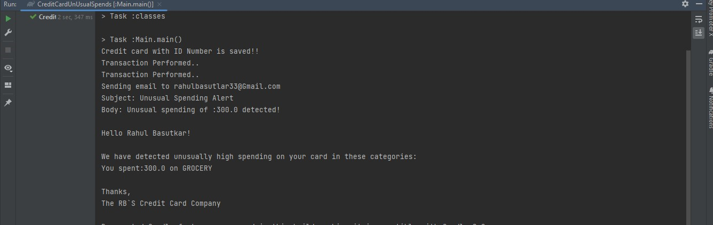

# Credit Card Unusual Spends

# Unusual Spends

You work at a credit card company and as a value-add they want to start providing alerts to users when their spending in any particular category is higher than usual.

## Functionality
- Compare the total amount paid for the current month, grouped by category, with the previous month.
- Filter down to the categories for which the user spent at least 50% more this month than last month.
- Compose an e-mail message to the user that lists the categories for which spending was unusually high.

## Sample Email

Subject: Unusual spending of ₹1076 detected!

Hello Baburao!

We have detected unusually high spending on your card in these categories:

You spent ₹148 on groceries
You spent ₹928 on travel
Thanks,

The Credit Card Company

## Design Analysis

### Controllers
- **Classes and Behaviors**
    - #### UserController
        - `Response createUser(int userId, String name, String email)`
        - **DTO**
            - `Response`
            - `Http` (Enum)
    - #### CreditCardController
        - `Response receiveCreditCardNumber(Long number)`
    - #### TransactionController
        - `Response initialiseTransaction(Date date, Category category, Double amount)`
    - #### ExpenditureController
        - `Response getSpends()`
    - #### NotificationController
        - `Response notifyUnusualSpending(int userId)`

### Outer Service
- **Classes and Behaviors**
    - #### UserService
        - `boolean createUser(int id, String name, String email)`
    - #### CreditCardService
        - `boolean createCard(long number)`
    - #### TransactionService
        - `boolean performTransaction(Date date, Category category, Double amount)`
    - #### ExpenditureService
        - `boolean getSpends()`
    - #### NotificationService
        - `void notifyUnusualSpends(int userId)`

### Domain
- **Model**
    - #### Categories (Enum)
    - #### Transaction
        - `Transaction createTransaction(Date date, Category category, Amount amount)` [Smart Constructor]

- **Service**
    - **Classes and Behaviors**
        - #### UnusualSpendAnalyser
            - `public Map<Categories, Double> calculateUnusualSpends(List<Transaction> transactionData)`
        - #### EmailService
            - `public void sendUnusualSpendAlert(UnusualSpendAlertDTO unusualSpendAlertDTO)`
            - `private void sendEmail(String to, String subject, String body)`
        - #### CurrentMonthTransaction
            - `public static List<Transaction> getCurrentMonthTransactions(List<Transaction> transactionData)`
        - #### LastMonthTransaction
            - `public static List<Transaction> getLastMonthTransactions(List<Transaction> transactionData)`
        - #### UnusualSpendDetector (interface)
            - `Map<Categories, Double> findUnusualSpends(Map<Categories, Double> currentMonthSpending, Map<Categories, Double> previousMonthSpending)`
            - **Implementation**
                - #### DefaultUnusualSpendDetector implements UnusualSpendDetector
                    - `public DefaultUnusualSpendDetector(double thresholdPercentage)`

### Repository (interface)
- #### UserRepository
    - `void addUser(int id, String name, String email)`
    - `Map<Integer, Map<String, String>> getUserData()`
    - `int getUserId()`
    - `String getUserNameById(int userId)`
    - `String getUserEmailById(int userId)`
- #### CreditCardRepository
    - `void addCreditCardDetails(int userId, long creditCardNumber)`
    - `Map<Integer, Long> getCreditCardDetails()`
    - `long getCreditCardNumber()`
    - `long getCreditCardNumberByUserId(int userId)`
- #### TransactionRepository
    - `boolean addTransactionData(long creditCardNumber, Transaction transaction)`
    - `List<Transaction> getTransactionDataFor(Long creditCardNumber)`
- #### ExpenditureRepository
    - `void addUnusualSpendData(Map<Categories, Double> unusualSpendData)`
    - `Map<String, Double> getUnusualSpendData(long ccNumber)`

### Database
- #### FakeDatabase (interface)
    - `void insertIntoUserTable(int id, String name, String email)`
    - `Map<Integer, Map<String, String>> getUserData()`
    - `int getId()`
    - `void InsertIntoCreditCardTable(int id, long CreditCardNumber)`
    - `Map<Integer, Long> getCreditCardData()`
    - `long getCreditCardNumber()`
    - `boolean insertIntoTransactionTable(long creditCardNumber, Transaction transaction)`
    - `List<Transaction> getTransactionData(Long creditCardId)`
    - `void insertIntoExpenditureDataTable(Map<Categories, Double> unusualSpendData)`
    - `String getUserNameById(int userId)`
    - `String getEmailById(int userId)`
    - `long getCreditCardNumberById(int userId)`
    - `Map<String, Double> getUnusualSpendDataFor(long ccNumber)`

### DTO
- **UnusualSpendAlertDTO**: Used for taking the information to send email.

### Module
- **AppModule**: For managing the dependencies.

## Workflow
- **UserController**: By using this, the system creates a unique user with the help of the service and stores it into the repository.
- **CreditCardController**: By using this, the system takes the credit card number from the user and, with the help of the service, validates it and saves it into the repository.
- **TransactionController**: This is used to initialize the transaction and, with the help of outer and inner services, saves all transactions in the repository.
- **ExpenditureController**: It is used to get the unusual spends from the current month and past month with the help of inner service and, if found, stores them in the repository.
- **NotificationController**: It is used to send an email to the user regarding unusual amount spends. We can utilize the notification service to send via email or other means. Just implement that and it can be plugged in.

## MainClass Output

